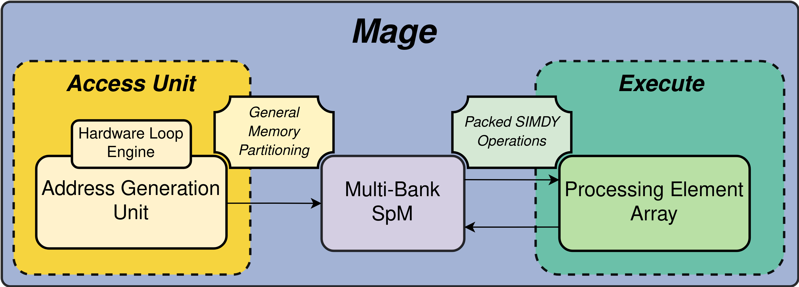

# Mage: a decoupled access-execute CGRA tailored for static control kernels

Mage is a Coarse-Grained Reconfigurable Architecture (CGRA) designed to accelerate static control kernels (i.e. kernels whose control flow does not feature data-dependent branches and can be determined at compile-time) by decoupling memory access from actual data computation. By offloading memory access management to a dedicated Address Generation Unit (AGU), Mage allows its Processing Element Array (PEA) to focus exclusively on data processing.

## About

Modern applications in the signal processing and machine learning domains demand architectures that combine flexibility with energy efficiency. At kernel level, static control flow and affine memory access patterns are key characteristics of these applications. While CGRAs can combine flexibility with energy efficiency, traditional approaches to these architectures often overlook a fundamental question: *can a subset of applications be identified that would benefit most from CGRA acceleration?*

Mage focuses on static control kernels as, thanks to their key characteristics (i.e. *static control flow*
and *affine memory access patterns*) they are particularly well-suited for CGRA acceleration. In addition, Mage leverages the *Decoupled Access-Execute* computation paradigm, which allows Mage to employ a dedicated unit (the AGU) tailored for address computation. By imposing a well-defined data layout (*Generalised Memory Partitioning Scheme (GMP)*) within the internal multi-bank Scratchpad Memory (SpM), multiple Address Generation Engines (AGE) inside Mage's AGU can access the SpM without incurring in conflict, thus achieving high bandwidth towards the PEA, which only focuses on data-related computation.

## Architecture Overview

The main components of Mage are the following:

### 1. Address Generation Unit (AGU)
It is in charge of computing addresses to access the internal multi-bank scratchpad memory, and it consists of:

- **Hardware Loop Unit (HLU):**  
  The HLU computes iteration variables (IVs) for up to four nested loops, which are essential for generating the affine address patterns typical of SCPs.
- **Address Generation Engines (AGEs):**  
  AGEs are configured via a 32-bit word to compute GMP-compliant addresses for up to 4D access to arrays.
- **Control and Dispatch:**  
  A Hardware Loop Dispatcher Unit (HLDU) selects the appropriate IVs from the Hardware Loop Register File (HLRF) and directs them to the AGEs. This mechanism ensures that load/store operations are issued correctly based on the control flow dictated by the IVs.

### 2. Processing Element Array (PEA)
- **2D Mesh Structure:**  
  The PEA is a grid of lightweight processing elements, each with a configurable functional unit. The PEs are designed to perform arithmetic and bitwise operations on 32-bit data. They also provide support for packed SIMDY operations on reduced-precision (8 or 16 bit-wide) operands.

### 3. Crossbars and Data Streams
- **Interconnection Strategy:**  
  Instead of a fully connected crossbar system, Mage employs smaller crossbar subsystems that link groups of AGEs, memory banks, and PEA I/O registers. This grouping facilitates the formation of distinct data streams for load and store operations, ensuring that address and data paths are efficiently managed with minimal conflict.

### 4. Multi-Bank Memory Subsystem
- **Generalized Memory Partitioning (GMP):**  
  Within the internal scratchpad memory (SpM), arrays are mapped across multiple banks using the GMP scheme, which distributes data blocks in a way that minimizes access conflicts and maximizes memory bandwidth.

